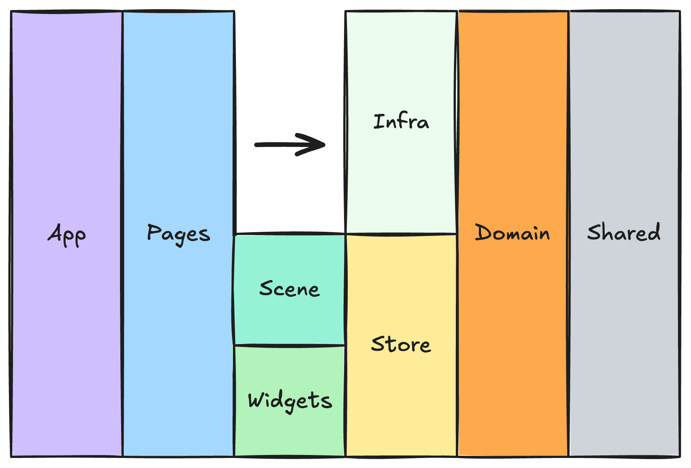

# Mine Explorer — Architecture

## Architecture Overview



## Dependency Rule

Более левый слой может использовать правостоящий слой, но базовые слои не должны знать о слоях, которые находятся левее.

## Layers

### `App`

Инициализация приложения: providers, router, глобальные стили, RootStore.

```text
App → Pages
```

### `Pages`

Композиция экранов и orchestration между слоями.

```text
Pages → Widgets
Pages → Scene
Pages → Infrastructure
Pages → Store
```

### `Widgets`

Крупные DOM-based UI-блоки:

```text
Widgets → Store
```

`Widgets` не управляет `Scene` напрямую.

### `Scene`

Отдельный WebGL / Three.js presentation layer.

```text
Scene → Store
Scene → Domain
```

`Scene` не знает, как данные были загружены или распарсены.

### `Store`

Mutable-состояние приложения.

```text
MineStore
→ Mine
→ loading
→ error

ViewerStore
→ selected entity
→ hidden horizons
→ hidden excavations
```

```text
Store → Domain
```

`Store` не зависит от `Infrastructure`.

### `Infrastructure`

Работа с внешними форматами и источниками данных.

```text
Infrastructure → Domain
```

### `Domain`

Независимое ядро приложения.

```text
Mine
Horizon
Excavation
Section
MineNode
```

`Domain` не зависит от React, MobX, Three.js, XML, MIM, DOMParser и Ant Design.

```text
Domain → Shared
```

### `Shared`

Общий низкоуровневый технический слой:

```text
shared/
├── ui/
├── lib/
├── config/
└── types/
```

Здесь находятся generic UI-компоненты, helpers, общие типы и конфигурация.

`Shared` не зависит от других архитектурных слоёв.

---

## Project Structure Model

```text
Layer
└── Slice
    └── Segment
        └── Files
```

Примеры slices:

```text
pages/mine-explorer
scene/mine
widgets/mine-tree
domain/mine
infrastructure/mim
store/viewer
```

Основные segments:

```text
ui
model
lib
```

Сегменты создаются только при необходимости и не должны появляться ради симметрии структуры.
